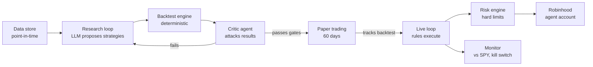
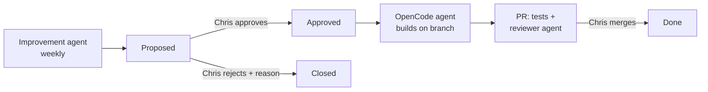

# Agentic Trading System — Build Spec

Sep 24, 2026 · @Chris

## Goal and success criteria

The system's real job is to find out, cheaply and honestly, whether any strategy it can build beats SPY after costs. 40% a year is the stretch target, not the pass bar. No harness can guarantee it, and the design assumes most strategies will fail validation.

The core design choice: **the LLM is the researcher, not the trader.** An LLM picking stocks each day has no known edge and is hard to backtest honestly. Instead, LLMs generate and critique systematic strategies; code backtests them; only strategies that survive strict gates trade live, executed by deterministic code.

| Metric | Pass bar (go live) | Stretch |
| --- | --- | --- |
| Annual return vs SPY, out-of-sample | Beats SPY by 3+ pts after costs | 40% absolute |
| Max drawdown | Under 25% | Under 15% |
| Sharpe ratio, out-of-sample | Above 1.0 | Above 1.5 |
| Paper-trading period | 60 trading days, tracks backtest within tolerance | 90 days |

**Kill criteria:** live account drawdown hits 20%, or 6 months of live trading underperforms SPY. Either one halts trading and moves the $1,000 into SPY.

This is not financial advice. Fund the agent account only with money you are fine losing.

## Architecture

Two loops, fully separated. The research loop is LLM-heavy and runs offline. The live loop is plain Python with an LLM only as a sanity check that can veto, never initiate.



Strategies are config files (YAML) plus small signal functions, not free-form prompts. That makes every trade reproducible and every result auditable.

## Phase 0: Robinhood integration

The system connects through the Robinhood Trading MCP at `https://agent.robinhood.com/mcp/trading` (streamable HTTP, authenticated through a Robinhood login). The Agentic account is opened during that first authentication, which must happen on a desktop browser. Phase 0's job is proving this connection works unattended.

**What the docs establish:**

- Any MCP-capable client can connect, including Claude Code (`claude mcp add robinhood-trading --transport http <url>`), Codex CLI, and Cursor.
- The agent can only trade in the Agentic account, but gets read access to every Robinhood account, including account numbers, positions, and full order history.
- The MCP exposes equities, options, and crypto trading. Margin borrowing is not enabled. Crypto via agent is unavailable in New York.
- Cash accounts wait 1 business day for sale proceeds to settle. "Limited margin" allows trading unsettled funds with no borrowing.
- If the agent is told to act without approval, it places trades without confirmation.

**MCP tools the system uses (allowlist):**

| Tool | Used by |
| --- | --- |
| `get_portfolio`, `get_equity_positions` | Risk engine: reconcile positions and buying power before every run |
| `get_equity_quotes` | Order pricing (up to 20 symbols per call) |
| `get_equity_tradability` | Pre-check that a symbol trades and supports fractional shares |
| `review_equity_order` | Mandatory dry run; any pre-trade warning blocks the order |
| `place_equity_order`, `cancel_equity_order`, `get_equity_orders` | Execution and fill tracking |
| `get_equity_tax_lots` | Short vs long-term status for weekly reports |
| `get_equity_historicals` | Cross-check the data provider's prices; not the primary source |

The broker wrapper exposes only these tools. `place_option_order`, `place_crypto_order`, and watchlist or scan writes are blocked in code, not by prompt.

**Decisions:**

- Open the Agentic account as a cash account. The risk engine tracks settled cash and never spends unsettled proceeds.
- Redact account numbers from all logs and LLM prompts, since the MCP returns them.
- Weekly or daily rebalancing fits the 1-day settlement lag comfortably.

**Phase 0 must prove, in order:**

1. A Python MCP client (official `mcp` SDK) authenticates once on Chris's Mac and stores a refreshable token.
2. That token keeps working from the VPS or GitHub Actions for 7+ days without a browser login.
3. `review_equity_order` on a $5 fractional limit order returns cleanly; then one real $5 order fills and is cancelled or sold.
4. Which order types the MCP accepts (limit, fractional limit), and any rate limits hit during a 20-call burst.

**If step 2 fails** (tokens need interactive re-login): run the executor as headless Claude Code (`claude -p`) on the VPS with the MCP attached, passing a fixed order list it may only execute, never change. Last resort: the system emails the order list and Chris places it.

- [ ] Open question: do pattern-day-trader rules apply to the Agentic account type, and does `review_equity_order` warn on good-faith violations in a cash account?

Sources: [Agentic Trading overview](https://robinhood.com/us/en/support/articles/agentic-trading-overview/), [Trading with your agent](https://robinhood.com/us/en/support/articles/trading-with-your-agent/).

## Data layer

Start with daily prices only. Most retail-reachable edges (momentum, trend, volatility targeting, sector rotation) need nothing else, and every extra feed adds cost and leakage risk.

| Source | Use | Phase | Notes |
| --- | --- | --- | --- |
| Daily OHLCV, adjusted, 20+ years | All strategies | 1 | Free tiers exist; agent picks one and documents it |
| Delisted tickers | Survivorship-bias control | 1 | Without these, backtests overstate returns |
| Risk-free rate, VIX | Regime filters, Sharpe | 1 | FRED is free |
| Fundamentals, point-in-time | Value/quality factors | 2 | Only if Phase 1 finds nothing |
| News / social sentiment | Event signals | 3, optional | Only with archived, timestamped history for backtests |

Rules the agent must follow:

- Store everything as Parquet, keyed by the date the data was *knowable*, not the date it describes.
- No live news feed unless a timestamped historical archive exists to backtest it. A signal you can't backtest doesn't trade.
- Universe: US ETFs plus S&P 500 constituents as of each historical date.

## Research harness

An LLM-driven loop proposes strategies, a separate agent implements them, a deterministic engine scores them, and a two-sided critic tries to break every result. The loop runs unattended, in batches. It follows the pattern of Microsoft's [RD-Agent(Q)](https://github.com/microsoft/RD-Agent): research, development, and feedback stages, with a bandit scheduler picking directions.

**The loop, per iteration:**

1. **Scheduler** (code, not LLM) picks which strategy family to explore next with a multi-armed bandit (e.g. Thompson sampling). Its reward is each family's best training-window score so far, so iterations flow toward promising families without starving the rest.
2. **Proposer** reads that family's ledger history and writes a hypothesis plus a YAML config: what the signal is, why it should work, and its parameters.
3. **Implementer** turns the hypothesis into a signal function under 80 lines, runs the unit tests and a smoke backtest, and retries on errors up to 3 times. A failed build is logged as `implementation_failed`, not as a failed idea.
4. **Backtest engine** runs it on the training window only (e.g. 2005–2018), with costs: 0.05% slippage per trade, and realistic fills at next-day open.
5. **Critic pair** debates the result. The bull argues it's a real effect; the bear hunts for look-ahead bias, overfitting (too many parameters), and dependence on one period. A judge records a verdict and the bear's strongest objection.
6. Result, verdict, and parameter count go into `ledger.parquet` and update the scheduler. The proposer never sees the holdout window's data or results.

**Leakage controls, enforced in code:**

- Data access goes through one function that takes an as-of date and refuses anything later.
- The holdout window (2019–present) is locked behind a flag the proposer can't set. It runs once per candidate, at the gate.
- The system counts every strategy tried. Results are judged against that count (deflated Sharpe), since testing 500 ideas guarantees some look great by chance.
- LLMs have seen historical prices in training. Strategies must be rules on data, never "buy NVDA" style picks the model may be remembering.

**Seed families** for the proposer to start from: cross-sectional momentum, trend-following on ETFs, volatility targeting, dual momentum, sector rotation, and low-volatility factors.

## Validation gates

A strategy must pass every gate in order; failing any one sends it back to the ledger as a failure. Only Chris can approve the jump from paper to live.

| Gate | Test | Pass condition |
| --- | --- | --- |
| 1. Training backtest | 2005–2018, with costs | Beats SPY, Sharpe above 0.8, 6 or fewer tunable parameters |
| 2. Walk-forward | Rolling 3-year fit, 1-year test windows | Beats SPY in at least 60% of windows |
| 3. Robustness | Parameters nudged ±20%, start date shifted | Performance degrades gracefully, no cliff |
| 4. Holdout | 2019–present, run once | Meets the pass bar in Goal and success criteria |
| 5. Paper trading | 60 trading days, live data, simulated fills | Daily returns track backtest; no execution errors |
| 6. Human approval | Chris reviews a one-page report | Explicit go |

The build agent generates the gate-6 report automatically: equity curve vs SPY, drawdowns, trade count, parameter list, and the critic's strongest objection.

## Live execution and risk engine

The live loop runs once a day after the close, computes target positions from the approved strategy, and places orders at the next open. Every order passes through a risk engine that no LLM can modify or bypass.

**Hard limits, in code, checked before every order:**

- Long-only equities and ETFs. No options, margin, shorting, or crypto.
- Max 25% of the account in one position; max 10 positions.
- No same-day round trips; max 3 day trades per rolling 5 business days (stays clear of pattern-day-trader rules, confirmed in Phase 0).
- Orders are limit orders within 1% of the last price; no market orders.
- Kill switch: account drawdown of 20% from peak halts all trading and pages Chris.
- Any unexpected state (position mismatch, API error, missing data) means no trades that day.

**LLM veto (optional):** before orders go out, a cheap model reads the order list and today's headlines for the held tickers. It can only flag "hold off" with a reason, logged for Chris. It can never add, size, or change a trade.

**Monitoring:** a daily log and a weekly summary of account vs SPY, sent by email or Slack. The limits file is read-only to the agent at runtime and changes only through a git commit Chris approves.

## Deployment

Trading runs once a day; everything intraday is defense only. Research runs on Chris's Mac; the live loop runs on always-on hosting so a closed laptop never matters. No AWS or Bedrock: this is a personal project on direct API keys.

| Job | Schedule | Where | Can trade? |
| --- | --- | --- | --- |
| Signal + orders | Daily after close; orders at next open | GitHub Actions cron or VPS | Yes |
| Risk check | Every 15–30 min, market hours | VPS cron (Actions cron can lag) | Halt and alert only |
| Research batches | On demand | Chris's Mac | No |
| Improvement agent | Weekly | GitHub Actions | No |

**Hosting:** start on GitHub Actions (free, no server). Move to a $5–6/month VPS (DigitalOcean, Hetzner) once intraday risk checks go live, since scheduled Actions runs can be delayed under load.

**Models and keys:** DeepSeek API or OpenRouter for proposer, reporter, and veto; Anthropic API for the critic and improvement agent. Keys live in GitHub Actions secrets or a `.env` on the VPS, never in the repo.

**Why not intraday trading:** strategies run on daily bars, so 5-minute checks add no signal. They add overtrading, slippage, day-trade limit risk, and short-term tax drag. A big-drop exit rule can be proposed as a strategy variant and must earn its place through the gates.

## Self-improvement

A weekly improvement agent proposes upgrades as cards on a GitHub Projects board. Chris approves; an OpenCode agent builds; nothing merges without Chris.



**Inputs the agent reads:** the strategy ledger, critic objections, paper and live drift vs backtest, error logs, and closed proposals with Chris's rejection reasons.

**Proposal template (GitHub Issue):**

| Field | Content |
| --- | --- |
| Problem | What's weak, in one or two sentences |
| Evidence | Links to ledger rows, logs, or drift charts |
| Proposed change | High-level description of the fix |
| Expected impact | What improves and how it will be measured |
| Files affected | Modules and configs that change |
| Tier | `infra` or `protected` |
| Effort | S / M / L |

**Anti-overfitting rules, enforced in code and `AGENTS.md`:**

- Evidence comes only from training-window data and system behavior. The improvement agent has no access to holdout results.
- Live underperformance can open a card, but any strategy change it motivates must be justified on training data.
- Strategy changes never patch the live strategy. They create a new version that restarts at gate 1.
- `protected` tier (anything touching `limits.yaml`, the holdout, or gate thresholds) cannot be triggered by the approval label. Chris edits those by hand.
- Max 3 proposals a week. The agent checks open and closed Issues first and never re-pitches a rejected idea without new evidence.

**Trigger:** adding the `approved` label to an `infra` Issue runs OpenCode's GitHub integration in an Actions workflow, which opens a PR on its own branch. The reviewer agent and the full test suite must pass before Chris sees it for merge.

- [ ] Open question: confirm OpenCode's GitHub integration can fire on a label event; if not, a small workflow on `issues: labeled` calls the OpenCode CLI directly.

## LLM roles and models

Spend on the builder and the critic, not the trader. A cheap open model is fine where the LLM only generates ideas or flags headlines; the build and the critique need a frontier model.

| Role | What it does | Model | Runs |
| --- | --- | --- | --- |
| Builder | Writes the repo from this spec | OpenCode, frontier model of Chris's choice | During build |
| Scheduler | Picks the next strategy family (bandit) | None, plain code | Every iteration |
| Proposer | Writes hypotheses and configs from the ledger | DeepSeek or another cheap open model | Batches of 20–50, offline |
| Implementer | Codes, tests, and debugs signal functions | Cheap coding model, 3 retries | Every candidate |
| Critic pair + judge | Bull and bear debate; judge records verdict | Frontier model, different from proposer | Every candidate |
| Reporter | Writes the gate-6 and weekly reports | Cheap model | Weekly |
| Veto | Flags headline risk on held tickers | Cheap model | Daily, optional |
| Improver | Files upgrade proposals as GitHub Issues | Frontier model (Anthropic API) | Weekly |

Using a different model family for the critic matters: a model reviewing its own ideas tends to agree with itself. Log every prompt and response to disk so any decision can be traced.

## Build plan

Build with OpenCode: hand it this spec as `SPEC.md` with a root `AGENTS.md`, and run an orchestrator plus builder/reviewer pairs in git worktrees. Claude Code is kept only for the first Robinhood login and the Phase 0 fallback executor. Each milestone ends with passing tests and a status file entry before the next starts.

| Milestone | Deliverable | Done when |
| --- | --- | --- |
| M0 | Integration report (Phase 0) | Chris confirms it matches the account |
| M1 | Data store + as-of accessor | Leakage test passes: accessor refuses future dates |
| M2 | Backtest engine | Buy-and-hold SPY reproduces known returns within 0.5%/yr |
| M3 | Seed strategies | 6 seed families backtested, results in ledger |
| M4 | Research loop (scheduler, proposer, implementer, critic pair) | 50 unattended iterations complete, ledger populated |
| M5 | Gates 1–4 + report generator | One strategy run end to end through the holdout |
| M6 | Paper trader + risk engine | 10 simulated days, every limit unit-tested |
| M7 | Live connector | First live order under $50, approved by Chris |
| M8 | Improvement agent, Issue template, board, approval-triggered Action | One test proposal goes Proposed → PR; protected-tier label refused |

**Root `AGENTS.md` rules for the builder:**

- Never edit `config/limits.yaml`, `data/holdout/`, or gate thresholds. Stop and ask.
- No live-account code until M6 passes.
- Every module ships with tests; the reviewer agent rejects any PR without them.
- Update `STATUS.md` after each milestone with what passed, what failed, and open questions for Chris.

The reviewer agent's checklist is the leakage controls in Research harness plus the hard limits in Live execution.

## Human touchpoints

Chris is needed at these points; everything else runs unattended.

- [ ] Open the Robinhood agent account and grant access (before M0)
- [ ] Provide API keys: data provider, DeepSeek or OpenRouter, Anthropic, notification channel (before M1)
- [ ] Confirm the Phase 0 integration report (end of M0)
- [ ] Review the gate-6 report for any strategy that clears the holdout
- [ ] Approve the first live order (M7)
- [ ] Respond to kill-switch alerts and weekly summaries; triage improvement cards weekly

If nothing clears gate 4 after roughly 300 proposer iterations, that is a valid result: it means no edge was found, and the $1,000 goes into SPY.

## Repo layout and acceptance tests

```
trading-agent/
  AGENTS.md          # builder rules
  SPEC.md            # this doc
  STATUS.md          # milestone log
  config/limits.yaml # read-only risk limits
  data/              # parquet, as-of keyed; holdout/ locked
  research/          # proposer, critic, ledger
  backtest/          # engine, costs, gates
  strategies/        # yaml + signal functions
  live/              # paper trader, risk engine, broker connector
  reports/           # gate-6 and weekly outputs
  improve/           # improvement agent, proposal template
  .github/           # workflows, issue template, approval trigger
  tests/
```

**Acceptance tests that must pass before any live money moves:**

1. As-of accessor raises on any request past its date.
2. Buy-and-hold SPY backtest matches published returns within 0.5% a year.
3. A deliberately leaky strategy (uses tomorrow's close) is caught by the critic or the accessor.
4. Each hard limit rejects a violating order in a unit test.
5. Kill switch halts trading on a simulated 20% drawdown.
6. Proposer process has no read access to `data/holdout/`.
7. Paper trader replays 10 historical days and matches the backtest's trades exactly.

## Sources

Comparable open-source projects reviewed for this design:

- [RD-Agent(Q), Microsoft](https://github.com/microsoft/RD-Agent): LLM research and code-generation loop with backtest feedback and a bandit scheduler. Closest match to this spec.
- [ai-hedge-fund](https://github.com/virattt/ai-hedge-fund): code pre-validates allowed actions and max quantities; the LLM picks within them.
- [TradingAgents](https://github.com/tauricresearch/tradingagents): LLM analyst, trader, and risk agents; non-deterministic and hard to backtest. Source of the bull/bear critic format.
- [Alpha Arena, Nof1](https://nof1.ai/blog/TechPost1): real-money LLM-as-trader benchmark; four of six models lost money in Season 1 ([results](https://forklog.com/en/four-out-of-six-ai-models-suffer-losses-in-trading-tournament/)).
